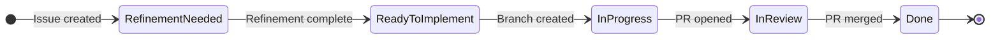

# Phtevens — Development Process

## Kanban Workflow

All work is tracked as GitHub Issues and progresses through the following columns:



---

## Column Definitions

### Refinement Needed
All new issues start here. The issue must be refined until requirements are clear, acceptance criteria are defined, and test cases exist in TESTSPEC.md.

**Entry:** Issue created.
**Exit:** Requirements meet all criteria in the [Requirements Standards](#requirements-standards) section. Acceptance criteria are written. At least one positive and one negative test case exist in TESTSPEC.md. Move to Ready to Implement.

---

### Ready to Implement
Issues that are fully defined and can be picked up immediately.

**Entry:** Requirements are clear, acceptance criteria are written, and at least one positive and one negative test case exist in TESTSPEC.md with expected results marked **Not yet implemented**.
**Exit:** Work is started and a branch is created. Move to In Progress.

---

### In Progress
A branch has been created and implementation is actively underway.

**Entry:** Branch created following naming convention `feature/issue-<number>-short-description`.
**Exit:** Implementation complete, all related test cases pass (no **Not yet implemented** annotations remain), PR opened. Move to In Review.

---

### In Review
A Pull Request is open and awaiting review and merge.

**Entry:** PR opened referencing the issue. All test cases pass in CI.
**Exit:** PR merged to main — move to Done. Issue closes automatically. Any requested changes are fixed directly on the PR branch without moving the issue back.

---

### Done
Work is merged to main and deployed.

**Entry:** PR merged to main. CI pipeline passes. GitHub Pages / Render deployment successful.

---

## Requirements Standards

All requirements — new and modified — must satisfy the following criteria before an issue can leave Refinement Needed.

### SMART Requirements
Each requirement must be **Specific, Measurable, Achievable, Realistic, and Testable**. Evaluate every requirement against:

| Criterion | What to check |
|-----------|--------------|
| **Correctness** | Consistent with source material. Only needed functionality — no nice-to-haves. |
| **Unambiguity** | Clear to any reader. Uses consistent terminology. |
| **Completeness** | All cases covered, including exception handling. Requirement is classified (functional or non-functional). |
| **Consistency** | Each requirement stated exactly once. Does not contradict other requirements. |
| **Verifiability** | Specific and measurable. Uniquely identified. Traceable to a test case. One requirement per statement. |

### Functional vs Non-Functional
Every issue that adds or changes requirements must consider both categories:

- **Functional** — what the system must do: data entry and validation, workflow and permissions, external interfaces.
- **Non-functional** — system characteristics: performance, reliability, availability, usability, maintainability, portability, scalability, error handling, security, and data integrity.

### Writing Level
Requirements are written at a generic, non-system-specific level — no implementation detail — but with enough precision to be correctly implemented and verified without ambiguity.

---

## Change Impact

When modifying an existing requirement, evaluate:

1. Does this change affect the existing risk assessment for the requirement?
2. Which other requirements are affected by this change?
3. Does this change affect the system design (database schema, API contracts, auth rules)?
4. Which existing test cases must be updated or added as a result?

All affected test cases in TESTSPEC.md must be updated before the issue moves to Ready to Implement.

---

## Implementation Rules

### Test Cases First
Test cases for a requirement must exist in TESTSPEC.md **before** implementation begins. When a test case is written ahead of implementation, its Expected Result must end with **Not yet implemented**.

```
Expected Result: Submission is rejected with a minimum odds error. **Not yet implemented.**
```

Remove the annotation only when the requirement is fully implemented and the test case passes against the correct implementation.

### Implementation Complete
Implementation is not complete until:
1. Every requirement being implemented has corresponding test cases in TESTSPEC.md.
2. All related test cases pass — no **Not yet implemented** annotations remain.
3. The full test suite passes with no regressions.

### Test File Naming
Each requirement gets its own test file under `tests/`, named after its requirement ID:

```
tests/fr01-coupon-submission.spec.js
tests/nfr01-usability.spec.js
```

### Test Structure
- Use `test.beforeEach` to call `POST /api/test/reset` when tests create or mutate data, so each test starts from a clean state.
- The reset endpoint is only available when `NODE_ENV=test` (set automatically by Playwright via `playwright.config.js`).
- Use API-level requests (`request` fixture) for setup and state verification. Use page-level interactions (`page` fixture) only when testing UI behaviour.

---

## Process Rules

1. All work must be tracked as a GitHub Issue before implementation begins.
2. An issue must be in **Ready to Implement** before a branch is created.
3. All test cases for requirements being implemented must exist in TESTSPEC.md before implementation starts, marked **Not yet implemented**.
4. All related test cases must pass before a PR is opened.
5. A PR must reference the issue number (e.g. `closes #12`) to auto-close it on merge.
6. Branches must follow the naming convention: `feature/issue-<number>-short-description`.
